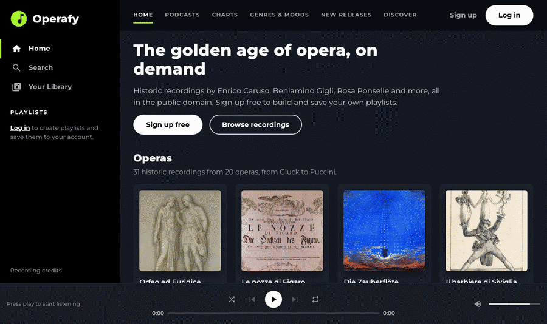
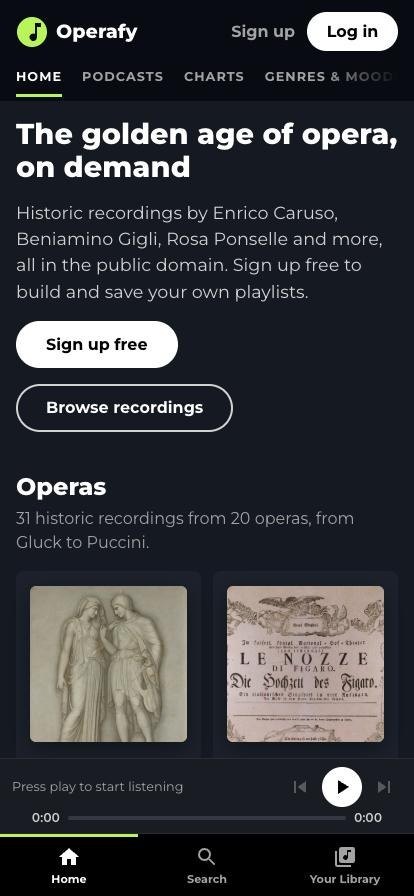
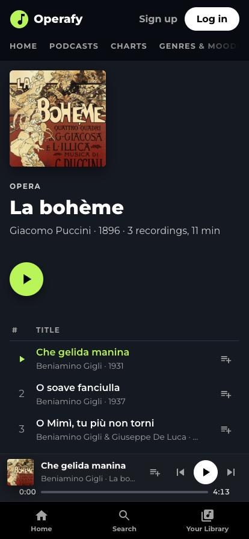

<p align="center">
  
</p>

<h1 align="center">Operafy</h1>

<p align="center">
  <strong>Spotify, but it only plays opera.</strong><br />
  Historic recordings by Caruso, Gigli and Ponselle, streamed from the public domain.
</p>

<p align="center">
  <a href="https://operafy-music.vercel.app"><strong>▶ Listen now at operafy-music.vercel.app</strong></a>
</p>

<p align="center">
  
  
  
  
</p>

<p align="center">
  
</p>

---

## The story

Operafy was my first HTML and CSS project, built in 2022 as a challenge during coding bootcamp. The brief was to push CSS as far as it would go and use the right HTML tag for everything.

I picked a Spotify clone, with one twist: **it would only play opera.** I knew nothing about opera, and that was half the fun.

This is the project that got me hooked on development. It was the first one where I set my alarm hours before class just to keep building. The play buttons didn't play anything and the playlists were typed straight into the code, but it looked like the real thing, and I was proud of it.

## 2026: the JavaScript update

Four years later, Claude and I gave it the update it deserved. The 2022 styling was the starting point, and now everything that looked like it worked actually does. In terms of this project, I've taken it as far as I would like to go, it's purpose was to learn HTML and CSS best practices, and it did that. The 2026 update just serves to revive a fun project, and remind myself of how it all started.

| | 2022 | 2026 |
| --- | --- | --- |
| **Music** | Decorative play buttons | 31 real recordings from 1896–1943 you can play |
| **Player** | Static icons and sliders | Play/pause, next/previous, shuffle, repeat, seek, volume, mute |
| **Playlists** | Hardcoded ("gym opera", "dubstep opera mashup") | Create, rename and delete your own, saved to your account |
| **Accounts** | A login button that did nothing | Sign up, log in and log out with Appwrite |
| **Pages** | One page | Real routes: `/home`, `/search`, `/playlists`, `/operas/:id` and more |
| **Search** | None | Songs, operas, composers, singers and your playlists |
| **Artwork** | Copyrighted album sleeves | Public-domain posters, scores and stage designs |
| **Language** | Italian | English |
| **Mobile** | Desktop only | Phone layout with a bottom tab bar and mini-player |
| **Hosting** | Local only | Live on Vercel |

Along the way:

- **Accessibility:** buttons that aren't buttons are gone, and track lists are proper tables.
- **Honest UI:** every page that isn't built yet says **Coming soon** instead of pretending.
- **Leftovers removed:** the "Install app" button and the Spotify logo.

<p align="center">
  
  &nbsp;&nbsp;
  
</p>

## How to use it

1. **Browse:** open [operafy-music.vercel.app](https://operafy-music.vercel.app). The home page lists every opera, from Gluck's *Orfeo ed Euridice* (1762) to Puccini's *Madama Butterfly* (1904).
2. **Play something:** hover over a cover and press the green play button, or open an opera and click any track. The player at the bottom has shuffle, repeat (all, then one track), seek and volume.
3. **Search:** use **Search** in the sidebar and try `caruso`, `puccini` or `boheme`. Accents are optional.
4. **Sign up:** create a free account with **Sign up**. You can listen without one, but playlists need an account.
5. **Make playlists:** click **Create playlist** in the sidebar, then use the add-to-playlist button next to any track, or pick from the recommendations on the playlist page. Your playlists are saved, so they're there next time you log in.
6. **Take it with you:** on a phone, the sidebar becomes a bottom tab bar and the player shrinks to a mini-player.

## The music and artwork

Everything you hear and see is in the public domain and comes from [Wikimedia Commons](https://commons.wikimedia.org/):

- **Recordings:** mostly 78 rpm discs digitised by the Swiss Public Domain Project. They include Enrico Caruso, Beniamino Gigli, Rosa Ponselle, Amelita Galli-Curci and Toti Dal Monte, plus La Scala under Lorenzo Molajoli.
- **Covers:** original posters by Adolfo Hohenstein and Leopoldo Metlicovitz, Karl Friedrich Schinkel's 1815 *Zauberflöte* stage design, Arthur Rackham's *Valkyrie* illustrations, and period scores and playbills.

The in-app [Credits page](https://operafy-music.vercel.app/credits) links every file to its source and licence.

> **Licensing note:** Commons tags these files as public domain. Recordings published before 1926 are public domain almost everywhere. Some of the later ones (1927–1943) are out of copyright in the UK and EU, but may still be protected in the US. That's fine for a portfolio project; check before any commercial use.

## Tech stack

- **Frontend:** React 18 (Create React App), React Router 7, plain CSS
- **Backend:** Appwrite Cloud (authentication, and TablesDB with owner-only row permissions), free tier
- **Hosting:** Vercel, free tier
- **Data:** Python scripts that build the track list and covers from the Wikimedia Commons API

## Running it locally

```bash
npm install
cp .env.example .env.local   # add your Appwrite project details
npm start                    # http://localhost:3000
```

Without Appwrite details, everything except accounts and playlists still works.

| Command | What it does |
| --- | --- |
| `npm start` | Start the dev server |
| `npm test` | Run the tests |
| `npm run build` | Build for production into `build/` |

### Setting up Appwrite

The database schema lives in `appwrite.config.json`. With the [Appwrite CLI](https://appwrite.io/docs/tooling/command-line/installation):

```bash
npx appwrite-cli login
npx appwrite-cli push tables --all
npx appwrite-cli project create-web-platform --project-id <project-id> \
  --platform-id web --name "Web" --hostname <your-domain>
```

Set `projectId` in `appwrite.config.json` to your own project before pushing. `localhost` is allowed by default; add a web platform for each deployed hostname.

| Variable | Example |
| --- | --- |
| `REACT_APP_APPWRITE_ENDPOINT` | `https://fra.cloud.appwrite.io/v1` |
| `REACT_APP_APPWRITE_PROJECT_ID` | your project ID |
| `REACT_APP_APPWRITE_DATABASE_ID` | `operafy` |
| `REACT_APP_APPWRITE_PLAYLISTS_TABLE_ID` | `playlists` |

Free Appwrite projects pause after a week without activity; resume them from the Appwrite console.

### Deploying to Vercel

`vercel.json` sends every route to `index.html`, so deep links like `/operas/la-boheme` work. Add the four `REACT_APP_APPWRITE_*` variables to the Vercel project, then run:

```bash
npx vercel --prod
```

### Regenerating the catalogue

- `python3 scripts/generate-tracks.py` rebuilds `src/data/tracks.json` from Wikimedia Commons.
- `python3 scripts/generate-covers.py` downloads and crops the covers listed in `scripts/cover-picks.json`. It needs Pillow (`pip install pillow`).

---

<p align="center">
  Built in 2022 with HTML, CSS and a lot of early mornings · Rebuilt in 2026 with React and a bit of help from Claude.
</p>
